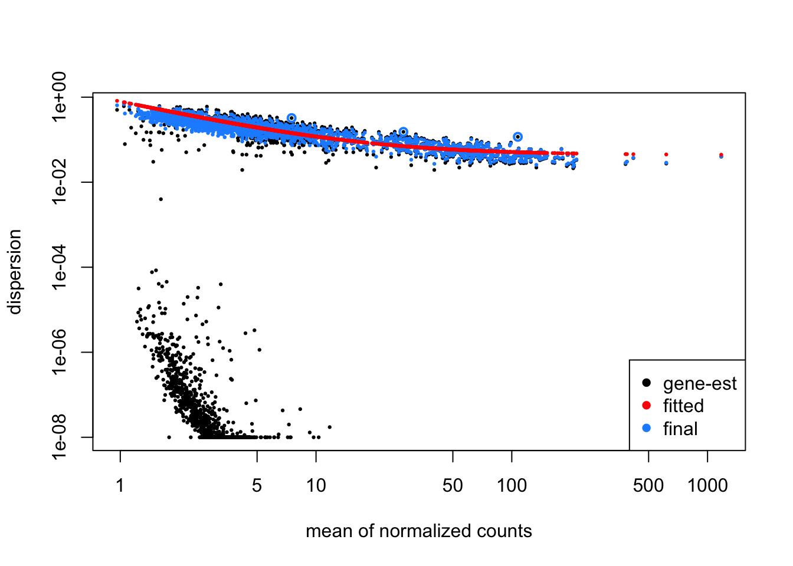
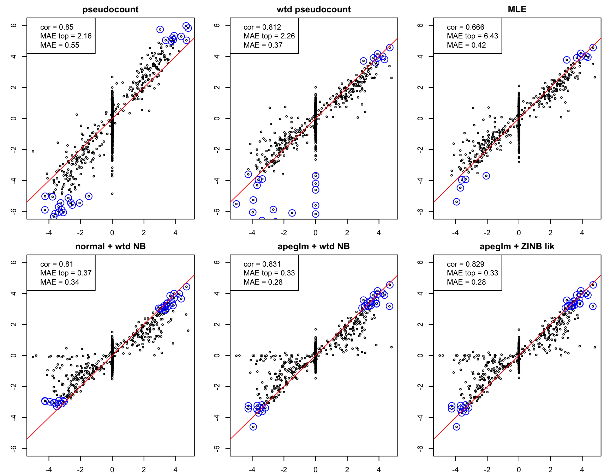

This document closely follows a similar
one, [zinbwave-deseq2](https://github.com/mikelove/zinbwave-deseq2),
showing integration of *zinbwave* with *DESeq2*. The difference is
that here we additionally assess when *apeglm* effect size estimation
may provide a benefit for zero-inflated Negative Binomial count data,
as may be produced in a single cell RNA-seq experiment (scRNA-seq).
*apeglm* effect sizes appear useful in the case that the groups of
cells we want to compare have small sample size, e.g. here the two
groups being compared have ~20 cells per group. It outperforms the
Normal distribution based shrinkage estimator when the ratio of DE
genes is low.

We use the *splatter* package to simulate single-cell RNA-seq data.

* Zappia, Phipson, and Oshlack "Splatter: simulation of single-cell RNA
sequencing data" *Genome Biology* (2017)
[doi: 10.1186/s13059-017-1305-0](https://doi.org/10.1186/s13059-017-1305-0)

We then use the methods defined in the following paper to combine
*zinbwave* observation weights with *DESeq2* modeling of negative
binomial counts. Finally we use *apeglm* to estimate LFC between two
groups that have few cells.

* Van den Berge & Perraudeau *et al* "Observation weights unlock bulk
RNA-seq tools for zero inflation and single-cell applications" *Genome Biology* (2018)
[doi: 10.1186/s13059-018-1406-4](https://doi.org/10.1186/s13059-018-1406-4)

> It is important to note that while methods such as ZINB-WaVE and
> ZINGER can successfully identify excess zeros, they cannot, however,
> readily discriminate between their underlying causes, i.e., between
> technical (e.g., dropout) and biological (e.g., bursting) zeros. 

We will try two approaches to integrating with *apeglm*:

1. Using *zinbwave* to define weights to account for the excess zeros,
   then using the Negative Binomial likelihood with *apeglm*.
2. Using *zinbwave* to define weights, then using these as a
   parameter for the probability of a zero coming from the zero
   component in a Zero-Inflated Negative Binomial likelihood with
   *apeglm*.
   
These two approaches end up having nearly identical results, while the
first is already built in to *DESeq2*'s *lfcShrink* function and has
been optimized for speed.


We construct simulated single cell data using *splatter*. The custom
parameters here define 1% of genes to identify each sub-group (so
comparing two groups we would expect 2% of genes to be DE), and the
non-null LFCs are set to be centered at a log2 fold change of 2. The
low percent of DE genes and relatively high LFC values help show the
difference between the Normal- and t-distributed priors in *DESeq2* and
*apeglm*. We specify three groups, where two of the groups will have
20 cells on average, and we will see how to compare the LFC between
these two groups.


```r
suppressPackageStartupMessages(library(splatter))
params <- newSplatParams()
# LFC centered at 2
params <- setParam(params, "de.facLoc", log(2) * 2)
params <- setParam(params, "de.facScale", log(2) * 1)
params <- setParam(params, "de.prob", .05)
# include drop-out 
params <- setParam(params, "dropout.type", "experiment")
params <- setParam(params, "dropout.mid", 2)
# three groups, we will show apeglm improvements on the two small groups
sim <- splatSimulate(params, group.prob=c(.2, .2, .6),
                     method="groups", seed=5)
```

```
## Getting parameters...
```

```
## Creating simulation object...
```

```
## Simulating library sizes...
```

```
## Simulating gene means...
```

```
## Simulating group DE...
```

```
## Simulating cell means...
```

```
## Simulating BCV...
```

```
## Simulating counts...
```

```
## Simulating dropout (if needed)...
```

```
## Sparsifying assays...
```

```
## Automatically converting to sparse matrices, threshold = 0.95
```

```
## Skipping 'BatchCellMeans': estimated sparse size 1.5 * dense matrix
```

```
## Skipping 'BaseCellMeans': estimated sparse size 1.5 * dense matrix
```

```
## Skipping 'BCV': estimated sparse size 1.5 * dense matrix
```

```
## Skipping 'CellMeans': estimated sparse size 1.49 * dense matrix
```

```
## Skipping 'TrueCounts': estimated sparse size 1.62 * dense matrix
```

```
## Skipping 'DropProb': estimated sparse size 1.5 * dense matrix
```

```
## Warning in sparsifyMatrices(assays(sim), auto = TRUE, verbose = verbose): matrix 'Dropout' is class
## 'matrixarray', unable to estimate size reduction factor
```

```
## Converting 'Dropout' to sparse matrix: estimated sparse size NA * dense matrix
```

```
## Converting 'counts' to sparse matrix: estimated sparse size 0.58 * dense matrix
```

```
## Done!
```

```r
table(sim$Group)
```

```
## 
## Group1 Group2 Group3 
##     28     13     59
```

```r
# define the true LFC
rowData(sim)$log2FC <- with(rowData(sim), log2(DEFacGroup2/DEFacGroup1))
```

As in the 
[zinbwave-deseq2](https://github.com/mikelove/zinbwave-deseq2)
repo, we run *zinbwave* to estimate the excess zeros and to define a
weight matrix for these.


```r
library(zinbwave)
keep <- rowSums(counts(sim) >= 10) >= 5
table(keep)
```

```
## keep
## FALSE  TRUE 
##  7786  2214
```

```r
zinb <- sim[keep,]
zinb$condition <- factor(zinb$Group)
nms <- c("counts", setdiff(assayNames(zinb), "counts"))
assays(zinb) <- assays(zinb)[nms]
assay(zinb) <- as.matrix(assay(zinb))
# epsilon setting as recommended by the ZINB-WaVE integration paper
zinb <- zinbwave(zinb, K=0, observationalWeights=TRUE,
                 BPPARAM=BiocParallel::SerialParam(), epsilon=1e12)
```

We additionally run *DESeq2* to estimate dispersions and maximum
likelihood estimates of log2 fold change. This again is the
recommended code from the
[zinbwave-deseq2](https://github.com/mikelove/zinbwave-deseq2) repo.


```r
suppressPackageStartupMessages(library(DESeq2))
dds <- DESeqDataSet(zinb, design=~condition)
```

```
## converting counts to integer mode
```

```r
library(scran)
scr <- computeSumFactors(dds)
# use scran's sum factors:
sizeFactors(dds) <- sizeFactors(scr)
# arguments as recommended from Van den Berge and Perraudeau
dds <- DESeq(dds, test="LRT", reduced=~1,
             minmu=1e-6, minRep=Inf)
```

```
## using pre-existing size factors
```

```
## estimating dispersions
```

```
## gene-wise dispersion estimates
```

```
## Warning in getAndCheckWeights(object, modelMatrix, weightThreshold = weightThreshold): for 6 row(s), the weights as supplied won't allow parameter estimation, producing a
##   degenerate design matrix. These rows have been flagged in mcols(dds)$weightsFail
##   and treated as if the row contained all zeros (mcols(dds)$allZero set to TRUE).
##   If you are blocking for donors/organisms, consider design = ~0+donor+condition.
```

```
## mean-dispersion relationship
```

```
## final dispersion estimates
```

```
## fitting model and testing
```

```r
dds <- dds[!mcols(dds)$weightsFail,]
```

We plot the dispersion estimates. If this plot fails, see the
suggested code in the
[zinbwave-deseq2](https://github.com/mikelove/zinbwave-deseq2) repo.


```r
plotDispEsts(dds)
```



We extract and compute a number of estimators for the LFC. 

First, we compute two simple pseudocount based LFC estimates, one without
using the excess zero weights, and the other using the weights to
account for excess zeros as identified by *zinbwave*.


```r
ncts <- counts(dds, normalized=TRUE)
wts <- assays(dds)[["weights"]]
idx1 <- dds$condition == "Group1"
idx2 <- dds$condition == "Group2"
pc <- .1
simple.lfc <- log2(rowMeans(ncts[,idx2])+pc) -
  log2(rowMeans(ncts[,idx1])+pc)
wtd.lfc <- log2(rowSums(ncts[,idx2]*wts[,idx2])/rowSums(wts[,idx2])+pc) -
  log2(rowSums(ncts[,idx1]*wts[,idx1])/rowSums(wts[,idx1])+pc)
```

The maximum likelihood estimate from *DESeq2*. All of the methods
using *DESeq2* will take into account the excess zero weights.


```r
res <- results(dds, name="condition_Group2_vs_Group1",
               independentFiltering=FALSE)
```

The "old" shrunken LFC from the original *DESeq2* paper, using the
Normal distribution:


```r
res.norm <- lfcShrink(dds, coef=2, type="normal")
```

```
## using 'normal' for LFC shrinkage, the Normal prior from Love et al (2014).
## 
## Note that type='apeglm' and type='ashr' have shown to have less bias than type='normal'.
## See ?lfcShrink for more details on shrinkage type, and the DESeq2 vignette.
## Reference: https://doi.org/10.1093/bioinformatics/bty895
```

The new shrunken LFC available in *DESeq2*, using the *apeglm* method
and a Negative Binomial likelihood, with excess zeros accounted for by
weights. In this case, the *apeglm* estimator is 10x faster to compute
than the normal distributed prior estimator above.


```r
ape.nb <- lfcShrink(dds, coef=2, type="apeglm")
```

```
## using 'apeglm' for LFC shrinkage. If used in published research, please cite:
##     Zhu, A., Ibrahim, J.G., Love, M.I. (2018) Heavy-tailed prior distributions for
##     sequence count data: removing the noise and preserving large differences.
##     Bioinformatics. https://doi.org/10.1093/bioinformatics/bty895
```

Finally, we will create a likelihood function for the Zero-Inflated
Negative Binomial, and set up a number of parameters to pass to the
*apeglm* function itself. This approach ends up with nearly identical
results to the use of *lfcShrink* to call *apeglm* above, while
requiring additional code and slower than the above to compute.


```r
library(apeglm)
library(ZIM)
Y <- counts(dds)
design <- model.matrix(design(dds), data=colData(dds))
disps <- dispersions(dds)
wts <- assays(dds)[["weights"]]
# combine dispersion and wts into a parameter matrix,
# which will be passed to apeglm
param <- cbind(disps, 1 - wts)
offset <- matrix(log(sizeFactors(dds)), nrow=nrow(dds),
                 ncol=ncol(dds), byrow=TRUE)
# need to put to natural log scale for apeglm
mle <- log(2) * cbind(res$log2FoldChange, res$lfcSE)
logLikZINB <- function (y, x, beta, param, offset) {
    xbeta <- x %*% beta + offset
    mean.hat <- exp(xbeta)
    k <- 1/param[1]
    omega <- param[-1]
    ZIM::dzinb(y, k=k, lambda=mean.hat, omega=omega, log=TRUE)
}
# run apeglm with a ZINB likelihood and zinbwave weights
# used to define the probability of an excess zero
fit <- apeglm(Y=Y, x=design, log.lik=logLikZINB, param=param,
              coef=2, mle=mle, offset=offset)
# need to put back to log2 scale
ape.zinb <- log2(exp(1)) * fit$map[,2]
```

Finally, we construct plots to compare our methods. We compute the
correlation over all genes, the median absolute error (MAE) of the top
30 genes, and over all genes.


```r
myplot <- function(x,y,n=30,...) {
  plot(x,y,ylim=c(-6,6),xlab="",ylab="",cex=.5,...)
  idx <- rank(-abs(y)) < n
  points(x[idx], y[idx], col="blue", cex=2)
  abline(0,1,col="red")
  lgd <- c(paste("cor =", round(cor(x,y,use="complete"),3)),
           paste("MAE top =", round(mean(abs(x[idx]-y[idx]), na.rm=TRUE),2)),
           paste("MAE =", round(mean(abs(x-y), na.rm=TRUE),2)))
  legend("topleft", legend=lgd)
}
```


```r
par(mfrow=c(2,3), mar=c(2,3,2,1))
myplot(mcols(dds)$log2FC, simple.lfc, main="pseudocount")
myplot(mcols(dds)$log2FC, wtd.lfc, main="wtd pseudocount")
myplot(mcols(dds)$log2FC, res$log2FoldChange, main="MLE")
myplot(mcols(dds)$log2FC, res.norm$log2FoldChange, main="normal + wtd NB")
myplot(mcols(dds)$log2FC, ape.nb$log2FoldChange, main="apeglm + wtd NB")
myplot(mcols(dds)$log2FC, ape.zinb, main="apeglm + ZINB lik")
```




```r
session_info()
```

```
## ─ Session info ───────────────────────────────────────────────────────────────────────────────────
##  setting  value                       
##  version  R version 4.0.3 (2020-10-10)
##  os       macOS Catalina 10.15.6      
##  system   x86_64, darwin17.0          
##  ui       X11                         
##  language (EN)                        
##  collate  en_US.UTF-8                 
##  ctype    en_US.UTF-8                 
##  tz       America/New_York            
##  date     2021-01-05                  
## 
## ─ Packages ───────────────────────────────────────────────────────────────────────────────────────
##  package              * version    date       lib source        
##  annotate               1.68.0     2020-10-27 [1] Bioconductor  
##  AnnotationDbi          1.52.0     2020-10-27 [1] Bioconductor  
##  apeglm               * 1.12.0     2020-10-27 [1] Bioconductor  
##  assertthat             0.2.1      2019-03-21 [1] CRAN (R 4.0.0)
##  backports              1.2.1      2020-12-09 [1] CRAN (R 4.0.2)
##  bbmle                  1.0.23.1   2020-02-03 [1] CRAN (R 4.0.0)
##  bdsmatrix              1.3-4      2020-01-13 [1] CRAN (R 4.0.0)
##  beachmat               2.6.4      2020-12-20 [1] Bioconductor  
##  Biobase              * 2.50.0     2020-10-27 [1] Bioconductor  
##  BiocGenerics         * 0.36.0     2020-10-27 [1] Bioconductor  
##  BiocNeighbors          1.8.2      2020-12-07 [1] Bioconductor  
##  BiocParallel         * 1.24.1     2020-11-06 [1] Bioconductor  
##  BiocSingular           1.6.0      2020-10-27 [1] Bioconductor  
##  bit                    4.0.4      2020-08-04 [1] CRAN (R 4.0.2)
##  bit64                  4.0.5      2020-08-30 [1] CRAN (R 4.0.2)
##  bitops                 1.0-6      2013-08-17 [1] CRAN (R 4.0.0)
##  blob                   1.2.1      2020-01-20 [1] CRAN (R 4.0.0)
##  bluster                1.0.0      2020-10-27 [1] Bioconductor  
##  callr                  3.5.1      2020-10-13 [1] CRAN (R 4.0.2)
##  checkmate              2.0.0      2020-02-06 [1] CRAN (R 4.0.0)
##  cli                    2.2.0      2020-11-20 [1] CRAN (R 4.0.2)
##  coda                   0.19-4     2020-09-30 [1] CRAN (R 4.0.2)
##  colorspace             2.0-0      2020-11-11 [1] CRAN (R 4.0.2)
##  crayon                 1.3.4      2017-09-16 [1] CRAN (R 4.0.0)
##  DBI                    1.1.0      2019-12-15 [1] CRAN (R 4.0.0)
##  DelayedArray           0.16.0     2020-10-27 [1] Bioconductor  
##  DelayedMatrixStats     1.12.1     2020-11-24 [1] Bioconductor  
##  desc                   1.2.0      2018-05-01 [1] CRAN (R 4.0.0)
##  DESeq2               * 1.30.0     2020-10-27 [1] Bioconductor  
##  devtools             * 2.3.2      2020-09-18 [1] CRAN (R 4.0.2)
##  digest                 0.6.27     2020-10-24 [1] CRAN (R 4.0.2)
##  dplyr                  1.0.2      2020-08-18 [1] CRAN (R 4.0.2)
##  dqrng                  0.2.1      2019-05-17 [1] CRAN (R 4.0.0)
##  edgeR                  3.32.0     2020-10-27 [1] Bioconductor  
##  ellipsis               0.3.1      2020-05-15 [1] CRAN (R 4.0.2)
##  emdbook                1.3.12     2020-02-19 [1] CRAN (R 4.0.0)
##  evaluate               0.14       2019-05-28 [1] CRAN (R 4.0.0)
##  fansi                  0.4.1      2020-01-08 [1] CRAN (R 4.0.0)
##  fs                     1.5.0      2020-07-31 [1] CRAN (R 4.0.2)
##  genefilter             1.72.0     2020-10-27 [1] Bioconductor  
##  geneplotter            1.68.0     2020-10-27 [1] Bioconductor  
##  generics               0.1.0      2020-10-31 [1] CRAN (R 4.0.2)
##  GenomeInfoDb         * 1.26.2     2020-12-08 [1] Bioconductor  
##  GenomeInfoDbData       1.2.4      2020-11-09 [1] Bioconductor  
##  GenomicRanges        * 1.42.0     2020-10-27 [1] Bioconductor  
##  ggplot2                3.3.3      2020-12-30 [1] CRAN (R 4.0.3)
##  glue                   1.4.2      2020-08-27 [1] CRAN (R 4.0.2)
##  gtable                 0.3.0      2019-03-25 [1] CRAN (R 4.0.0)
##  htmltools              0.5.0      2020-06-16 [1] CRAN (R 4.0.2)
##  httr                   1.4.2      2020-07-20 [1] CRAN (R 4.0.2)
##  igraph                 1.2.6      2020-10-06 [1] CRAN (R 4.0.2)
##  IRanges              * 2.24.1     2020-12-12 [1] Bioconductor  
##  irlba                  2.3.3      2019-02-05 [1] CRAN (R 4.0.0)
##  knitr                  1.30       2020-09-22 [1] CRAN (R 4.0.2)
##  lattice                0.20-41    2020-04-02 [1] CRAN (R 4.0.3)
##  lifecycle              0.2.0      2020-03-06 [1] CRAN (R 4.0.0)
##  limma                  3.46.0     2020-10-27 [1] Bioconductor  
##  locfit                 1.5-9.4    2020-03-25 [1] CRAN (R 4.0.0)
##  magrittr               2.0.1      2020-11-17 [1] CRAN (R 4.0.2)
##  MASS                   7.3-53     2020-09-09 [1] CRAN (R 4.0.3)
##  Matrix                 1.3-0      2020-12-22 [1] CRAN (R 4.0.2)
##  MatrixGenerics       * 1.2.0      2020-10-27 [1] Bioconductor  
##  matrixStats          * 0.57.0     2020-09-25 [1] CRAN (R 4.0.2)
##  memoise                1.1.0      2017-04-21 [1] CRAN (R 4.0.0)
##  munsell                0.5.0      2018-06-12 [1] CRAN (R 4.0.0)
##  mvtnorm                1.1-1      2020-06-09 [1] CRAN (R 4.0.2)
##  numDeriv               2016.8-1.1 2019-06-06 [1] CRAN (R 4.0.0)
##  pillar                 1.4.7      2020-11-20 [1] CRAN (R 4.0.2)
##  pkgbuild               1.2.0      2020-12-15 [1] CRAN (R 4.0.2)
##  pkgconfig              2.0.3      2019-09-22 [1] CRAN (R 4.0.0)
##  pkgload                1.1.0      2020-05-29 [1] CRAN (R 4.0.2)
##  plyr                   1.8.6      2020-03-03 [1] CRAN (R 4.0.0)
##  prettyunits            1.1.1      2020-01-24 [1] CRAN (R 4.0.0)
##  processx               3.4.5      2020-11-30 [1] CRAN (R 4.0.2)
##  ps                     1.5.0      2020-12-05 [1] CRAN (R 4.0.2)
##  purrr                  0.3.4      2020-04-17 [1] CRAN (R 4.0.0)
##  R6                     2.5.0      2020-10-28 [1] CRAN (R 4.0.2)
##  RColorBrewer           1.1-2      2014-12-07 [1] CRAN (R 4.0.0)
##  Rcpp                   1.0.5      2020-07-06 [1] CRAN (R 4.0.2)
##  RCurl                  1.98-1.2   2020-04-18 [1] CRAN (R 4.0.0)
##  remotes                2.2.0      2020-07-21 [1] CRAN (R 4.0.2)
##  rlang                  0.4.9      2020-11-26 [1] CRAN (R 4.0.2)
##  rmarkdown            * 2.6        2020-12-14 [1] CRAN (R 4.0.2)
##  rprojroot              2.0.2      2020-11-15 [1] CRAN (R 4.0.2)
##  RSQLite                2.2.1      2020-09-30 [1] CRAN (R 4.0.2)
##  rsvd                   1.0.3      2020-02-17 [1] CRAN (R 4.0.0)
##  S4Vectors            * 0.28.1     2020-12-09 [1] Bioconductor  
##  scales                 1.1.1      2020-05-11 [1] CRAN (R 4.0.0)
##  scran                * 1.18.3     2020-12-21 [1] Bioconductor  
##  scuttle                1.0.4      2020-12-17 [1] Bioconductor  
##  sessioninfo            1.1.1      2018-11-05 [1] CRAN (R 4.0.0)
##  SingleCellExperiment * 1.12.0     2020-10-27 [1] Bioconductor  
##  softImpute             1.4        2015-04-08 [1] CRAN (R 4.0.0)
##  sparseMatrixStats      1.2.0      2020-10-27 [1] Bioconductor  
##  splatter             * 1.14.1     2020-12-01 [1] Bioconductor  
##  statmod                1.4.35     2020-10-19 [1] CRAN (R 4.0.2)
##  stringi                1.5.3      2020-09-09 [1] CRAN (R 4.0.2)
##  stringr                1.4.0      2019-02-10 [1] CRAN (R 4.0.0)
##  SummarizedExperiment * 1.20.0     2020-10-27 [1] Bioconductor  
##  survival               3.2-7      2020-09-28 [1] CRAN (R 4.0.3)
##  testthat             * 3.0.1      2020-12-17 [1] CRAN (R 4.0.2)
##  tibble                 3.0.4      2020-10-12 [1] CRAN (R 4.0.2)
##  tidyselect             1.1.0      2020-05-11 [1] CRAN (R 4.0.2)
##  usethis              * 2.0.0      2020-12-10 [1] CRAN (R 4.0.2)
##  vctrs                  0.3.6      2020-12-17 [1] CRAN (R 4.0.2)
##  withr                  2.3.0      2020-09-22 [1] CRAN (R 4.0.2)
##  xfun                   0.19       2020-10-30 [1] CRAN (R 4.0.2)
##  XML                    3.99-0.5   2020-07-23 [1] CRAN (R 4.0.2)
##  xtable                 1.8-4      2019-04-21 [1] CRAN (R 4.0.0)
##  XVector                0.30.0     2020-10-28 [1] Bioconductor  
##  yaml                   2.2.1      2020-02-01 [1] CRAN (R 4.0.0)
##  ZIM                  * 1.1.0      2018-08-28 [1] CRAN (R 4.0.2)
##  zinbwave             * 1.12.0     2020-10-28 [1] Bioconductor  
##  zlibbioc               1.36.0     2020-10-28 [1] Bioconductor  
## 
## [1] /Library/Frameworks/R.framework/Versions/4.0/Resources/library
```
